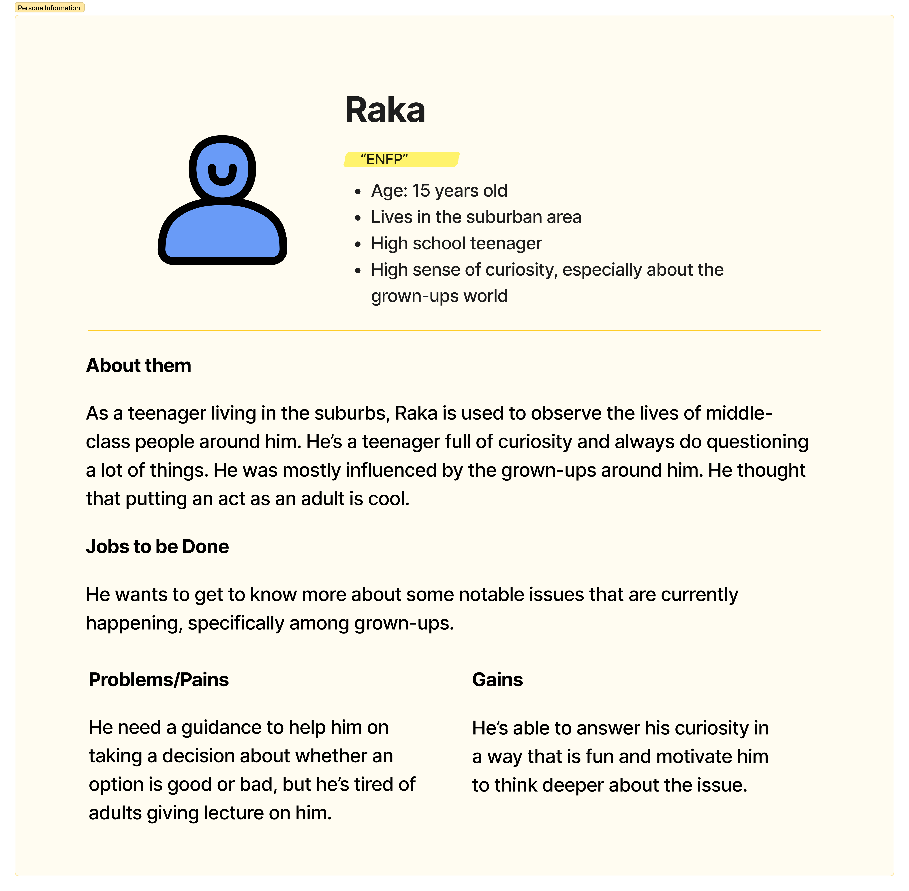

## Hi there 👋

  
Awas Judol! is an educational web-based application about online gambling that consists of gamification learning contents in form of quizzes. This application provides a bottom-up solution as a preventive way to educate teenagers about the risks that came along with online gambling. Generative AI is used to create the questions related to the story on each level. Each level has the same topic of questions but can be generated differently on different user.

<!--

**Here are some ideas to get you started:**

🙋‍♀️ A short introduction - what is your organization all about?
🌈 Contribution guidelines - how can the community get involved?
👩‍💻 Useful resources - where can the community find your docs? Is there anything else the community should know?
🍿 Fun facts - what does your team eat for breakfast?
🧙 Remember, you can do mighty things with the power of [Markdown](https://docs.github.com/github/writing-on-github/getting-started-with-writing-and-formatting-on-github/basic-writing-and-formatting-syntax)
-->

### User Persona

### User Journey Map

### Empathy Map

### Architecture

